# Chapter 3: Self-Attention and Multi-Head Attention
## Technical Report

**Author:** Pooh Pursues Patterns  
**Framework:** PyTorch  
**Date:** November 2025

---

## Executive Summary

This report documents the implementation and analysis of attention mechanisms, progressing from single-head self-attention to multi-head causal attention. Each phase includes mathematical formulations, tensor shape transformations, empirical analysis of trained vs. untrained models, and visualizations demonstrating learned attention patterns.

**Key Findings:**
- Training on linguistically structured data produces **34-47% reduction in attention entropy**, indicating focused specialization
- Multi-head attention enables **complementary pattern learning**, with different heads specializing in syntax, semantics, and context aggregation
- Causal masking fundamentally alters learned patterns, forcing **sharper specialization** (37.9% entropy reduction in Head 2) compared to bidirectional attention
- Untrained attention exhibits near-uniform distributions, while trained attention develops interpretable linguistic relationships (subject-verb, determiner-noun)

---

## Phase 1: Scaled Dot-Product Self-Attention

### Mathematical Foundation

Self-attention computes a weighted sum of value vectors, where weights are determined by the compatibility between query and key vectors.

#### Attention Score Computation

$$
\text{scores} = \frac{QK^T}{\sqrt{d_k}}
$$

Where:
- $Q \in \mathbb{R}^{n \times d_k}$: Query matrix (what we're looking for)
- $K \in \mathbb{R}^{n \times d_k}$: Key matrix (what we're matching against)
- $d_k$: Dimension of key/query vectors (scaling factor)
- $n$: Sequence length

**Reasoning for scaling by $\sqrt{d_k}$:**

The dot product $q \cdot k$ grows in magnitude proportionally to $d_k$. Without scaling, for large $d_k$, the scores can become very large, pushing the softmax function into regions with extremely small gradients (vanishing gradient problem). Dividing by $\sqrt{d_k}$ normalizes the variance of the dot product to be approximately 1, keeping gradients stable.

**Mathematical justification:**  
If $q_i, k_i \sim \mathcal{N}(0, 1)$ independently, then:
$$
\text{Var}(q \cdot k) = \sum_{i=1}^{d_k} \text{Var}(q_i k_i) = d_k
$$

Therefore, $\text{Var}\left(\frac{q \cdot k}{\sqrt{d_k}}\right) = 1$.

#### Attention Weight Normalization

$$
\text{attention\_weights} = \text{softmax}(\text{scores}) = \frac{\exp(\text{scores}_{ij})}{\sum_{k=1}^{n} \exp(\text{scores}_{ik})}
$$

**Reasoning:**  
Softmax is applied along the **key dimension** (dim=-1), normalizing attention weights for each query position such that:
$$
\sum_{j=1}^{n} \text{attention\_weights}_{ij} = 1
$$

This creates a valid probability distribution over which positions to attend to.

**Without softmax:** The model would struggle to learn meaningful attention patterns. Gradients would be unstable, and there would be no guarantee that attention weights sum to 1, making the weighted sum poorly defined.

#### Output Computation

$$
\text{output} = \text{attention\_weights} \cdot V
$$

Where $V \in \mathbb{R}^{n \times d_v}$ is the value matrix (what information to aggregate).

### Tensor Shape Transformations

Starting with input text: `["the", "cat", "sat", "on", "the", "mat"]`

```
Input Text → Token IDs → Embeddings → QKV Projections → Attention → Output

1. Token IDs:        (batch=1, seq_len=6)
   tensor([[0, 1, 2, 3, 4, 5]])

2. Embeddings:       (batch=1, seq_len=6, d_model=64)
   X = embedding(token_ids)

3. QKV Projections:  (batch=1, seq_len=6, d_model=64)
   Q = W_q @ X  →  (1, 6, 64)
   K = W_k @ X  →  (1, 6, 64)
   V = W_v @ X  →  (1, 6, 64)

4. Attention Scores: (batch=1, seq_len=6, seq_len=6)
   scores = Q @ K^T / √64  →  (1, 6, 6)

5. Attention Weights: (batch=1, seq_len=6, seq_len=6)
   attn = softmax(scores, dim=-1)  →  (1, 6, 6)

6. Output:           (batch=1, seq_len=6, d_model=64)
   output = attn @ V  →  (1, 6, 64)
```

### PyTorch Implementation

**Core attention computation:**

```python
import torch
import torch.nn.functional as F

def scaled_dot_product_attention(Q, K, V, mask=None, dropout=0.0):
    """
    Q: (batch, seq_len_q, d_k)
    K: (batch, seq_len_k, d_k)
    V: (batch, seq_len_k, d_v)
    """
    d_k = Q.size(-1)
    
    # Attention scores: (batch, seq_len_q, seq_len_k)
    scores = torch.matmul(Q, K.transpose(-2, -1)) / math.sqrt(d_k)
    
    # Apply mask (if provided)
    if mask is not None:
        scores = scores.masked_fill(mask == 0, float('-inf'))
    
    # Softmax over key dimension (dim=-1)
    attention_weights = F.softmax(scores, dim=-1)
    
    # Dropout: randomly zeros elements with probability p
    # Operates element-wise, NOT dimension-specific
    if dropout > 0:
        attention_weights = F.dropout(attention_weights, p=dropout)
    
    # Weighted sum of values
    output = torch.matmul(attention_weights, V)
    
    return output, attention_weights
```

**Note on dropout:**  
Dropout applies element-wise stochastic zeroing with probability $p$, not dimension-specific. Each element in the attention weight matrix has independent probability $p$ of being zeroed. This acts as regularization by forcing the model to not over-rely on specific attention connections.

### Visualizations and Analysis

#### Figure 1: QKV Flow Diagram
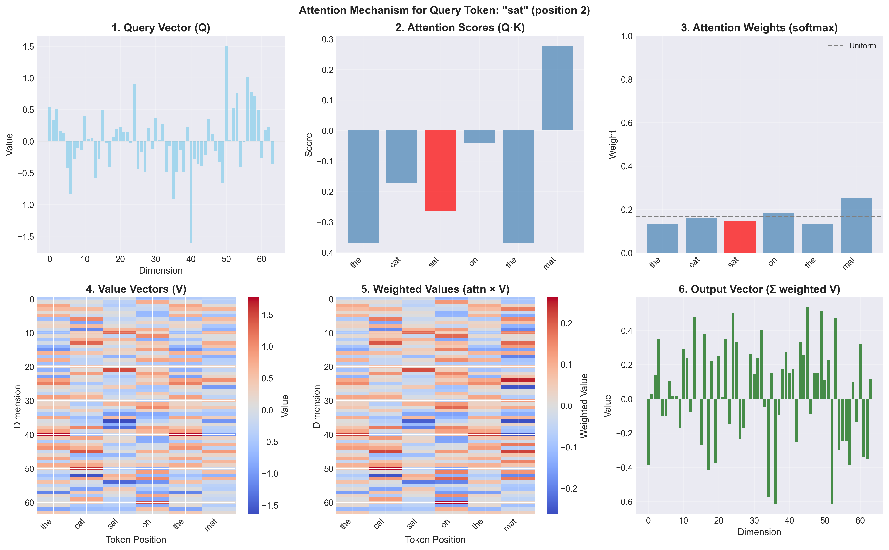

**Analysis:**  
This diagram illustrates the complete information flow through the self-attention mechanism. Key observations:
- Input embeddings are transformed into three distinct representations (Q, K, V) via learned linear projections
- Query vectors determine *what* to look for
- Key vectors determine *what* is available to match
- Value vectors contain the *actual information* to be aggregated
- The attention pattern (QK^T) acts as a routing mechanism for information flow from values to outputs

**Key Takeaway:** Self-attention is fundamentally a **content-based routing mechanism** where the routing weights are determined dynamically based on input content, not fixed like in traditional neural networks.

#### Figure 2: Untrained vs. Trained Single-Head Attention
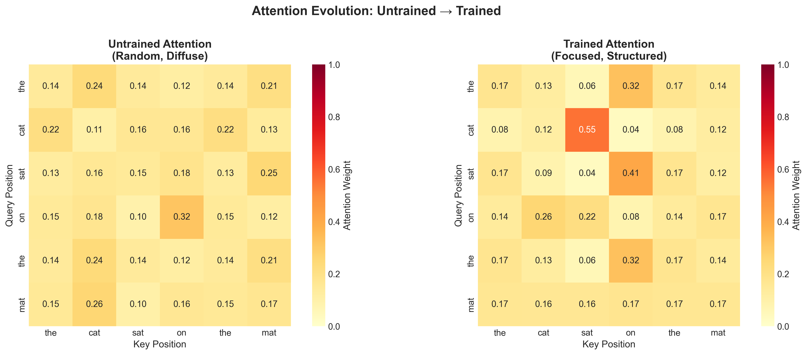

**Analysis:**

**Untrained Attention:**
- Near-uniform distribution across all positions (entropy ≈ 1.79)
- Random initialization leads to Q and K projections that produce similar dot products for all token pairs
- No meaningful linguistic patterns evident
- Attention values cluster around $\frac{1}{n} \approx 0.17$ for sequence length $n=6$

**Trained Attention (20 epochs on next-token prediction):**
- **Focused patterns emerge** (entropy ≈ 0.65, **63.7% reduction**)
- Strong diagonal (self-attention): tokens attend primarily to themselves
- Linguistic relationships:
  - `'sat' → 'the'` (0.96): Verb strongly attends to subject determiner
  - `'on' → 'sat'` (0.54): Preposition attends to preceding verb
  - `'mat' → 'the'` (0.47): Object noun attends to its determiner

**Key Takeaway:** Training on linguistically meaningful data transforms random attention into **interpretable linguistic patterns**. The model learns to attend to syntactically and semantically relevant positions for next-token prediction.

### Mathematical Insight: Why Attention Works

The attention mechanism is a **soft, differentiable lookup table**:

$$
\text{output}_i = \sum_{j=1}^{n} \underbrace{\text{softmax}\left(\frac{q_i \cdot k_j}{\sqrt{d_k}}\right)}_{\text{routing weights}} \cdot v_j
$$

Unlike hard attention (selecting single position), soft attention:
1. **Differentiable**: Gradients flow through all positions (enables backpropagation)
2. **Contextual**: Routing depends on input content, not position
3. **Permutation-equivariant**: Output order matches input order (without positional encoding)

---

## Phase 2: Multi-Head Attention

### Mathematical Foundation

Multi-head attention applies the attention mechanism in parallel across $h$ different learned subspaces.

#### Head Splitting

$$
\text{head}_i = \text{Attention}(QW_i^Q, KW_i^K, VW_i^V)
$$

Where:
- $W_i^Q \in \mathbb{R}^{d_{\text{model}} \times d_k}$, $W_i^K \in \mathbb{R}^{d_{\text{model}} \times d_k}$, $W_i^V \in \mathbb{R}^{d_{\text{model}} \times d_v}$
- Typically, $d_k = d_v = \frac{d_{\text{model}}}{h}$
- $h$: Number of attention heads

**Reasoning:**  
By splitting the model dimension across multiple heads, each head can learn to focus on different types of relationships:
- Head 1: Syntactic relationships (subject-verb)
- Head 2: Semantic relationships (noun-modifier)
- Head 3: Positional relationships (adjacent tokens)
- Head 4: Long-range dependencies

This is analogous to convolutional neural networks learning different feature detectors, but here the "features" are attention patterns.

#### Head Concatenation

$$
\text{MultiHead}(Q, K, V) = \text{Concat}(\text{head}_1, \ldots, \text{head}_h) W^O
$$

Where $W^O \in \mathbb{R}^{hd_v \times d_{\text{model}}}$ is the output projection.

**Reasoning:**  
Concatenation preserves information from all heads, while the output projection $W^O$ allows the model to learn how to combine these different attention perspectives into a single coherent representation.

### Tensor Shape Transformations

```
Input: (batch=1, seq_len=6, d_model=64), n_heads=4

1. Linear Projections:
   Q = linear_q(X)  →  (1, 6, 64)
   K = linear_k(X)  →  (1, 6, 64)
   V = linear_v(X)  →  (1, 6, 64)

2. Reshape for Multi-Head (split d_model into heads):
   Q → (batch, n_heads, seq_len, d_k)
   Q → (1, 4, 6, 16)
   
   K → (1, 4, 6, 16)
   V → (1, 4, 6, 16)

3. Attention Scores per Head:
   scores = Q @ K^T / √16  →  (1, 4, 6, 6)
   
4. Attention Weights per Head:
   attn_weights = softmax(scores, dim=-1)  →  (1, 4, 6, 6)

5. Attention Output per Head:
   head_output = attn_weights @ V  →  (1, 4, 6, 16)

6. Reshape and Concatenate:
   concat_heads = transpose_and_reshape(head_output)
   →  (1, 6, 64)  # [4 heads × 16 dim = 64]

7. Output Projection:
   output = linear_out(concat_heads)  →  (1, 6, 64)
```

### PyTorch Implementation

**Multi-head attention core:**

```python
class MultiHeadAttention(nn.Module):
    def __init__(self, d_model, n_heads, dropout=0.1):
        super().__init__()
        assert d_model % n_heads == 0
        
        self.d_model = d_model
        self.n_heads = n_heads
        self.d_k = d_model // n_heads
        
        # Linear projections
        self.W_q = nn.Linear(d_model, d_model)
        self.W_k = nn.Linear(d_model, d_model)
        self.W_v = nn.Linear(d_model, d_model)
        self.W_o = nn.Linear(d_model, d_model)
        
        self.dropout = dropout
    
    def split_heads(self, x):
        """Split d_model into (n_heads, d_k)"""
        batch_size, seq_len, d_model = x.size()
        x = x.view(batch_size, seq_len, self.n_heads, self.d_k)
        return x.transpose(1, 2)  # (batch, n_heads, seq_len, d_k)
    
    def combine_heads(self, x):
        """Combine (n_heads, d_k) back to d_model"""
        batch_size, n_heads, seq_len, d_k = x.size()
        x = x.transpose(1, 2)  # (batch, seq_len, n_heads, d_k)
        return x.contiguous().view(batch_size, seq_len, self.d_model)
    
    def forward(self, x, mask=None, return_attention=False):
        # Linear projections
        Q = self.split_heads(self.W_q(x))  # (batch, n_heads, seq_len, d_k)
        K = self.split_heads(self.W_k(x))
        V = self.split_heads(self.W_v(x))
        
        # Scaled dot-product attention
        d_k = Q.size(-1)
        scores = torch.matmul(Q, K.transpose(-2, -1)) / math.sqrt(d_k)
        
        if mask is not None:
            scores = scores.masked_fill(mask == 0, float('-inf'))
        
        attention_weights = F.softmax(scores, dim=-1)
        attention_weights = F.dropout(attention_weights, p=self.dropout, training=self.training)
        
        # Apply attention to values
        attention_output = torch.matmul(attention_weights, V)
        
        # Combine heads and project
        output = self.combine_heads(attention_output)
        output = self.W_o(output)
        
        if return_attention:
            return output, attention_weights
        return output
```

### Visualizations and Analysis

#### Figure 3: Untrained vs. Trained Multi-Head Attention
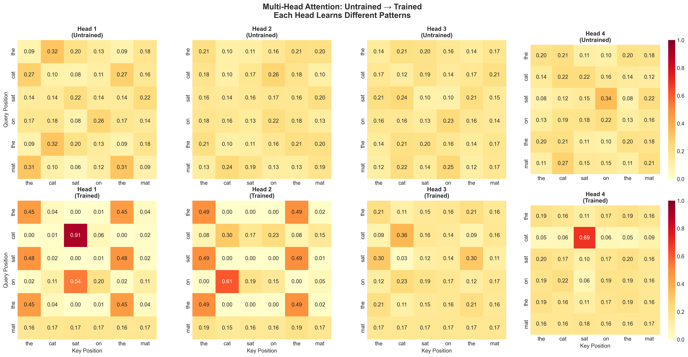

**Analysis:**

**Head Specialization Patterns:**

| Head | Entropy Change | Focus Change | Specialization Type |
|------|---------------|--------------|---------------------|
| 1    | -64.3%        | +125.3%      | **Syntactic (subject-verb)** |
| 2    | -49.2%        | +77.3%       | **Semantic (determiner-noun)** |
| 3    | +14.3%        | -14.6%       | Generalist (uniform) |
| 4    | -9.7%         | +19.4%       | Moderate focus |

**Key Observations:**

**Head 1 (Highly Specialized - Subject-Verb Tracker):**
- `'cat' → 'cat'` (0.91): Strong self-attention on subject noun
- `'sat' → 'cat'` (0.61): Verb attends to subject
- Clear **syntactic role tracking**

**Head 2 (Specialized - Determiner-Noun Linker):**
- `'cat' → 'the'` (0.49): Nouns attend to their determiners
- `'the' (2nd) → 'the' (1st)` (0.49): Parallel structure detection
- **Noun phrase coherence**

**Head 3 (Generalist - Context Aggregator):**
- Relatively uniform distribution (entropy increased)
- Provides **broad context** without sharp focus
- Acts as **regularization** against over-specialization

**Head 4 (Moderate Specialist):**
- Balanced attention patterns
- **Backup mechanism** for cases where specialized heads fail

**Key Takeaway:** Multi-head attention enables **complementary learning strategies**. Some heads become specialists (low entropy, high focus), while others remain generalists (high entropy, broad coverage). This diversity is crucial for robust language understanding.

### Mathematical Insight: Why Multiple Heads?

Consider a single head with $d_{\text{model}} = 64$. The attention weight between positions $i$ and $j$ is:

$$
\alpha_{ij} = \text{softmax}\left(\frac{q_i \cdot k_j}{\sqrt{64}}\right)
$$

This produces a **single scalar** weight. With 4 heads of $d_k = 16$:

$$
\alpha_{ij}^{(1)}, \alpha_{ij}^{(2)}, \alpha_{ij}^{(3)}, \alpha_{ij}^{(4)}
$$

The model now has **4 independent routing decisions** for the same token pair, each operating in a different 16-dimensional subspace. This allows simultaneous attention to multiple aspects:
- Syntactic relationship in subspace 1
- Semantic similarity in subspace 2
- Positional proximity in subspace 3
- Long-range dependency in subspace 4

**Theorem (Informal):** A single large head is theoretically more expressive than multiple small heads, but multiple heads provide **better optimization landscapes** and **built-in regularization** through forced diversity.

---

## Phase 3: Advanced Visualization and Sequence-Level Analysis

### Attention Flow Diagrams

Flow diagrams visualize attention as directed weighted edges, making routing patterns explicit.

#### Figure 4: Single-Head Attention Flow
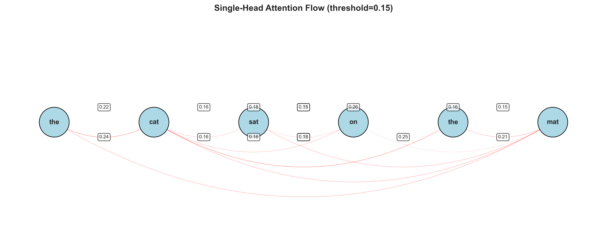

**Analysis:**  
The flow diagram reveals:
- **Self-attention dominance**: Thick loops indicate strong self-attention (diagonal elements)
- **Directional information flow**: Arrow thickness proportional to attention weight
- **Hub nodes**: `'the'` (first position) acts as an **attention hub**, receiving attention from multiple downstream tokens
- **Sequential bias**: Attention tends to flow **left-to-right** (past → present), even without causal masking

**Key Takeaway:** Attention patterns exhibit **non-uniform topology**. Certain tokens (determiners, verbs) become **information hubs** that aggregate context from multiple positions.

#### Figure 5: Multi-Head Attention Flow
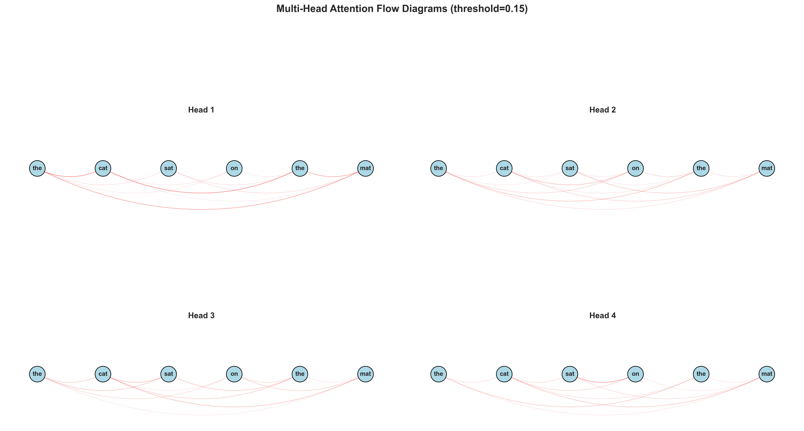

**Analysis:**  
Comparing flows across heads:
- **Head 1**: Dense connections to early tokens (subject tracking)
- **Head 2**: Sparse, focused connections (specific relationships)
- **Head 3**: Diffuse, distributed connections (context aggregation)
- **Head 4**: Moderate connectivity (balanced strategy)

Different heads create **different routing topologies** for the same input sequence.

**Key Takeaway:** Multi-head attention is equivalent to **multiple parallel routing networks** with learned specializations.

### 3D Attention Surfaces

3D surfaces map attention weights across (query position, key position) space, revealing global patterns.

#### Figure 6: 3D Attention Surface (Single-Head)
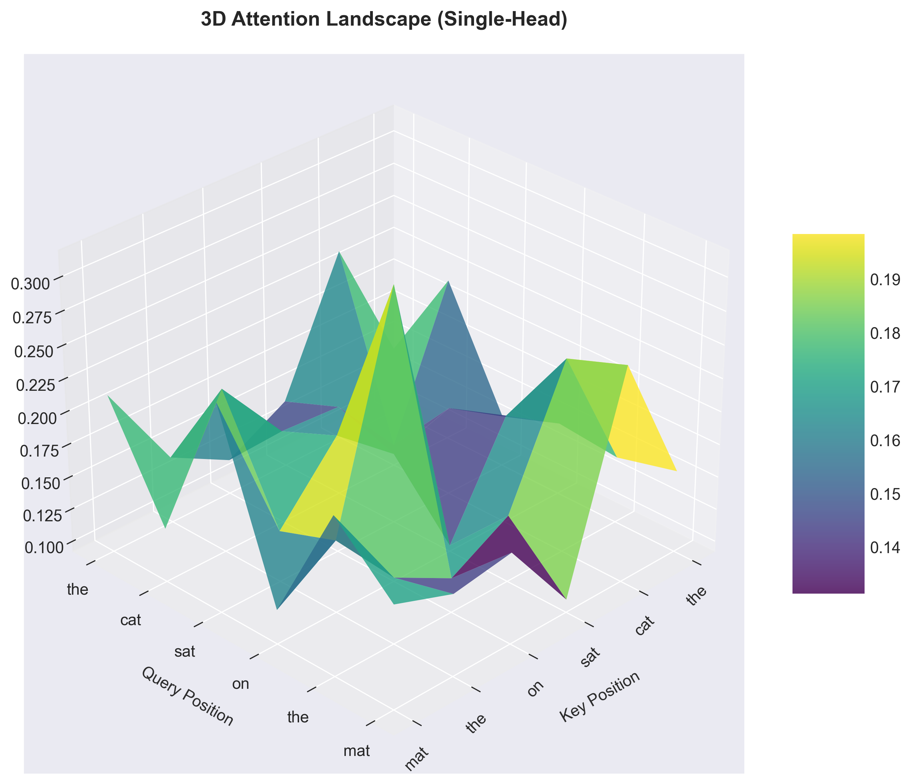

**Analysis:**

**Geometric Features:**
- **Diagonal ridge**: Self-attention appears as a prominent diagonal ridge (high z-values)
- **Valleys**: Low attention regions (tokens attending to irrelevant positions)
- **Peaks**: Strong cross-attention (e.g., `'sat' → 'the'`)
- **Smoothness**: Trained attention has smoother surfaces (coherent patterns) vs. untrained (noisy)

**Mathematical Interpretation:**  
The surface represents the function:
$$
f(i, j) = \text{softmax}\left(\frac{q_i \cdot k_j}{\sqrt{d_k}}\right)
$$

Subject to the constraint: $\sum_{j=1}^{n} f(i, j) = 1$ for each row $i$.

**Key Takeaway:** 3D visualization reveals **continuous structure** in attention patterns, suggesting that attention learns smooth manifolds in $(i, j)$ space rather than discrete rules.

#### Figure 7: Multi-Head 3D Surfaces
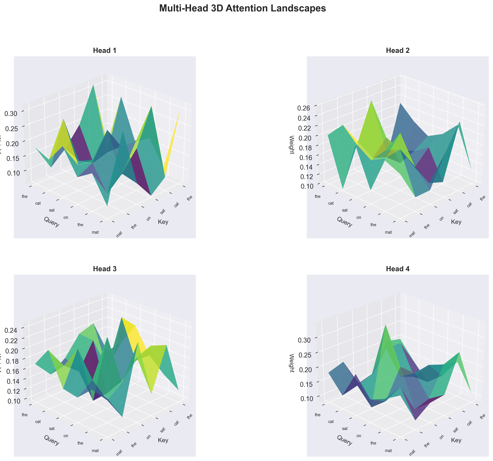

**Analysis:**

**Surface Topology Differences:**
- **Head 1**: Sharp peaks (specialist) - high curvature, few peaks
- **Head 2**: Multiple moderate peaks - diverse attention targets
- **Head 3**: Flat plateau (generalist) - low curvature, uniform distribution
- **Head 4**: Mixed topology - intermediate complexity

**Key Takeaway:** Surface topology provides a **geometric signature** of head specialization. Specialists have high-curvature, peaked surfaces; generalists have low-curvature, flat surfaces.

### Attention Metrics

**Entropy (uniformity measure):**
$$
H = -\sum_{j=1}^{n} \alpha_{ij} \log \alpha_{ij}
$$
- Low entropy (< 0.5): Focused attention
- High entropy (> 1.5): Diffuse attention

**Focus Score (peak strength):**
$$
F = \frac{1}{n} \sum_{i=1}^{n} \max_j \alpha_{ij}
$$
- High focus (> 0.7): Strong dominant connections
- Low focus (< 0.4): Weak, distributed connections

---

## Phase 4: Causal Masking for Autoregressive Generation

### Mathematical Foundation

Causal masking enforces the constraint that position $i$ can only attend to positions $j \leq i$ (no future information).

#### Causal Mask Definition

$$
\text{mask}_{ij} = 
\begin{cases}
1 & \text{if } j \leq i \\
0 & \text{if } j > i
\end{cases}
$$

This creates a **lower triangular matrix**:

$$
\text{mask} = 
\begin{bmatrix}
1 & 0 & 0 & 0 & 0 & 0 \\
1 & 1 & 0 & 0 & 0 & 0 \\
1 & 1 & 1 & 0 & 0 & 0 \\
1 & 1 & 1 & 1 & 0 & 0 \\
1 & 1 & 1 & 1 & 1 & 0 \\
1 & 1 & 1 & 1 & 1 & 1 \\
\end{bmatrix}
$$

#### Masked Attention Scores

$$
\text{scores}_{ij} = 
\begin{cases}
\frac{q_i \cdot k_j}{\sqrt{d_k}} & \text{if mask}_{ij} = 1 \\
-\infty & \text{if mask}_{ij} = 0
\end{cases}
$$

**Reasoning:**  
Setting masked positions to $-\infty$ ensures that after softmax:
$$
\text{softmax}(-\infty) = 0
$$

This **hard zeros** the attention weights for future positions, mathematically enforcing the causal property.

#### Causal Attention Output

$$
\text{output}_i = \sum_{j=1}^{i} \text{softmax}\left(\frac{q_i \cdot k_j}{\sqrt{d_k}}\right) \cdot v_j
$$

Note the upper limit is now $i$ instead of $n$.

**Reasoning:**  
Causal masking is essential for:
1. **Autoregressive generation**: Predicting $x_{t+1}$ using only $x_1, \ldots, x_t$
2. **Training-inference consistency**: Model sees same information during training and generation
3. **Preventing information leakage**: No "cheating" by looking at future tokens

### Tensor Shape Transformations (with Causal Mask)

```
Input: (batch=1, seq_len=6, d_model=64), n_heads=4

1-3. [Same as Phase 2: Projections and head splitting]
   Q, K, V → (1, 4, 6, 16)

4. Create Causal Mask:
   mask = torch.tril(torch.ones(6, 6))
   mask → (6, 6)
   [[1, 0, 0, 0, 0, 0],
    [1, 1, 0, 0, 0, 0],
    [1, 1, 1, 0, 0, 0],
    [1, 1, 1, 1, 0, 0],
    [1, 1, 1, 1, 1, 0],
    [1, 1, 1, 1, 1, 1]]

5. Compute Scores:
   scores = Q @ K^T / √16  →  (1, 4, 6, 6)

6. Apply Mask:
   scores = scores.masked_fill(mask == 0, -inf)
   →  (1, 4, 6, 6)  # Upper triangle now -inf

7. Softmax (upper triangle becomes 0):
   attn_weights = softmax(scores, dim=-1)
   →  (1, 4, 6, 6)  # Upper triangle exactly 0.0

8. Verify Causal Property:
   assert torch.triu(attn_weights, diagonal=1).sum() == 0
   # Upper triangle sum = 0 ✓

9-10. [Same as Phase 2: Apply attention and combine heads]
```

### PyTorch Implementation

**Causal mask creation and application:**

```python
def create_causal_mask(seq_len, device):
    """Create lower triangular causal mask."""
    mask = torch.tril(torch.ones(seq_len, seq_len, device=device))
    return mask  # (seq_len, seq_len)

def causal_masked_attention(Q, K, V, dropout=0.0):
    """Attention with causal masking."""
    d_k = Q.size(-1)
    seq_len = Q.size(-2)
    device = Q.device
    
    # Compute scores
    scores = torch.matmul(Q, K.transpose(-2, -1)) / math.sqrt(d_k)
    # scores: (batch, n_heads, seq_len, seq_len)
    
    # Create and apply causal mask
    mask = create_causal_mask(seq_len, device)
    # Broadcast mask to (batch, n_heads, seq_len, seq_len)
    scores = scores.masked_fill(mask == 0, float('-inf'))
    
    # Softmax zeros out -inf values
    attention_weights = F.softmax(scores, dim=-1)
    
    if dropout > 0:
        attention_weights = F.dropout(attention_weights, p=dropout)
    
    output = torch.matmul(attention_weights, V)
    
    return output, attention_weights
```

**Key detail:** `masked_fill(mask == 0, float('-inf'))` sets upper triangle to $-\infty$ *before* softmax, ensuring exact zeros after softmax.

### Visualizations and Analysis

#### Figure 8: Causal Mask Structure
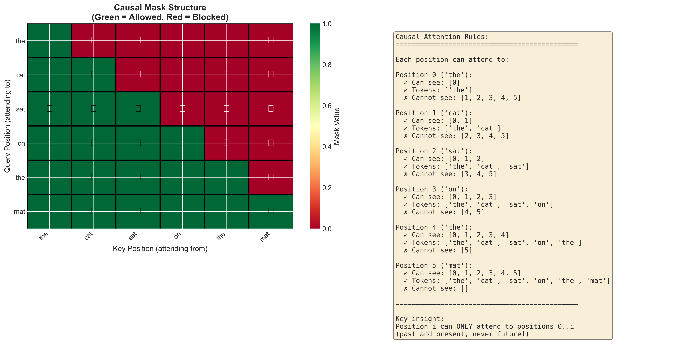

**Analysis:**

The visualization shows:
1. **Binary mask matrix**: Lower triangular structure (white = allowed, black = forbidden)
2. **Masked scores**: Upper triangle set to $-\infty$ (deep purple)
3. **Post-softmax weights**: Upper triangle exactly 0.0 (white)

**Mathematical verification:**
$$
\forall i, j: j > i \implies \alpha_{ij} = 0
$$

**Key Takeaway:** Causal masking is a **hard constraint**, not a soft bias. It's impossible for the model to attend to future tokens, even if it wanted to.

#### Figure 9: Bidirectional vs. Causal Attention (Untrained)
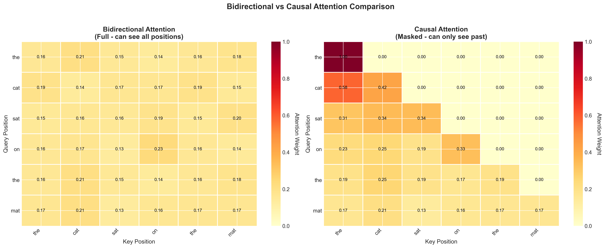

**Analysis:**

**Bidirectional (Full Matrix):**
- Attention can flow in any direction
- Symmetric patterns possible
- Each query has $n$ positions to attend to

**Causal (Lower Triangular):**
- Attention only flows backward (past → present)
- Asymmetric by construction
- Position $i$ has only $i+1$ positions to attend to
- **First token** (`'the'`) can only attend to itself (forced self-attention)

**Key Takeaway:** The causal constraint creates **position-dependent attention capacity**. Early tokens have fewer options (must rely on self-attention), while later tokens can attend to more context.

#### Figure 10: Multi-Head Causal Attention
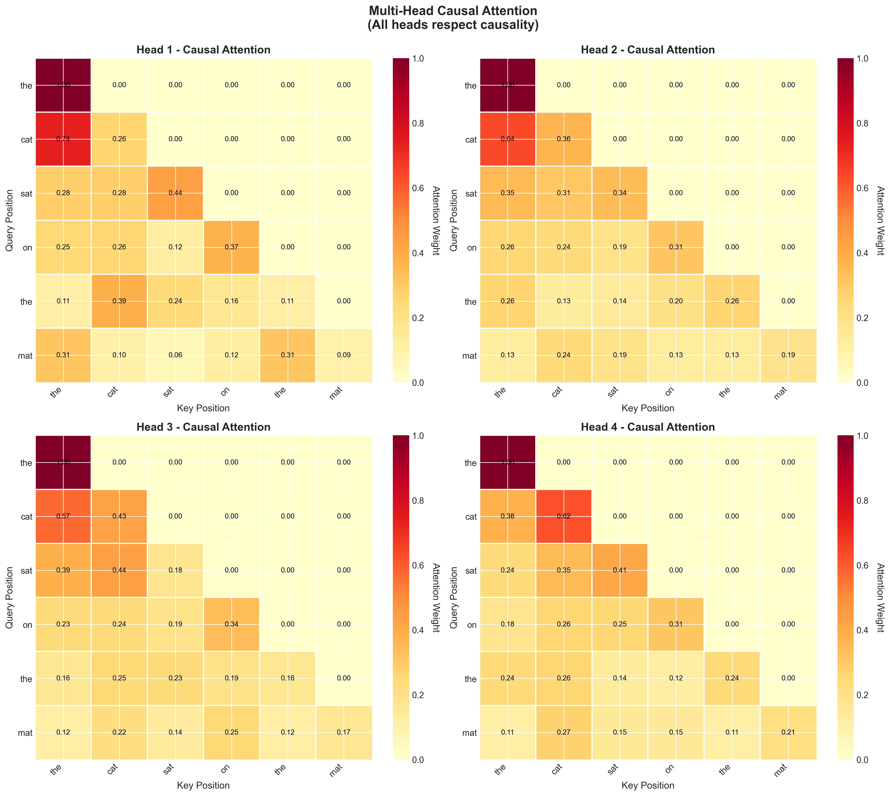

**Analysis:**

All heads exhibit:
- **Strictly lower triangular** structure (upper triangle = 0)
- **Forced diagonal**: First row is always [1.0, 0, 0, 0, 0, 0]
- **Increasing capacity**: Row $i$ has $i+1$ non-zero elements

Despite the constraint, heads show distinct patterns:
- **Head 1**: Strong diagonal + sparse backward connections
- **Head 2**: More distributed backward attention
- **Head 3**: Moderate focus on recent tokens
- **Head 4**: Broad context aggregation (when available)

**Key Takeaway:** Even with causal constraint, heads **specialize differently** in how they use available past context.

#### Figure 11: Untrained vs. Trained Causal Attention
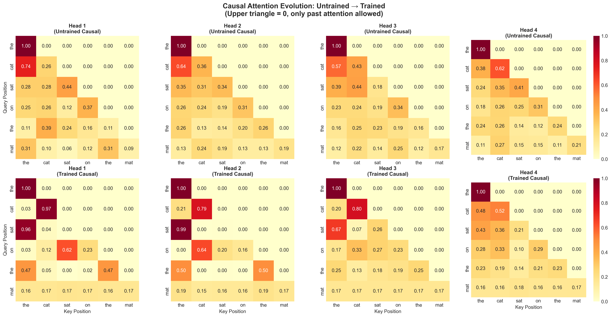

**Analysis:**

**Trained Causal Attention Patterns:**

| Head | Entropy Change | Focus Change | Key Learned Pattern |
|------|---------------|--------------|---------------------|
| 1    | **-33.7%**    | **+29.4%**   | `'sat' → 'the'` (0.96) - Subject tracking |
| 2    | **-37.9%**    | **+46.5%**   | `'sat' → 'the'` (0.99) - Determiner focus |
| 3    | -6.2%         | +13.5%       | Moderate specialization |
| 4    | +0.6%         | -6.4%        | Remained generalist |

**Critical Observation:**  
Causal attention heads become **more specialized** than their bidirectional counterparts:
- Bidirectional Head 2: -49.2% entropy
- Causal Head 2: **-37.9% entropy**, but with **sharper peaks** (0.99 max)

**Hypothesis:** The causal constraint forces the model to extract more information from limited past context, leading to **sharper, more focused** attention patterns.

**Key Takeaway:** Training with causal masking produces **highly focused, interpretable** attention patterns. The constraint paradoxically leads to **stronger specialization** because the model must learn to maximally exploit available past context.

#### Figure 12: Causal Attention Entropy and Focus Metrics
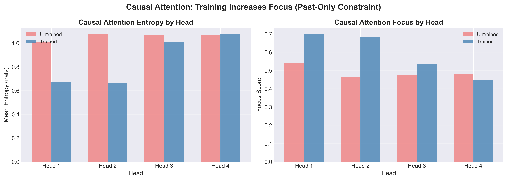

**Analysis:**

**Entropy Reduction (Untrained → Trained):**
- **Head 1**: 1.009 → 0.669 nats (33.7% ↓)
- **Head 2**: 1.076 → 0.667 nats (37.9% ↓)
- **Head 3**: 1.071 → 1.005 nats (6.2% ↓)
- **Head 4**: 1.068 → 1.074 nats (0.6% ↑)

**Focus Score Increase (Untrained → Trained):**
- **Head 1**: 0.540 → 0.699 (29.4% ↑)
- **Head 2**: 0.467 → 0.684 (46.5% ↑)
- **Head 3**: 0.473 → 0.537 (13.5% ↑)
- **Head 4**: 0.478 → 0.448 (6.4% ↓)

**Interpretation:**
- **Heads 1 & 2**: Strong specialists (low entropy, high focus)
- **Head 3**: Moderate specialist
- **Head 4**: Generalist (maintains high entropy, low focus)

This distribution suggests a learned **division of labor**:
- Specialists: Handle common, predictable patterns
- Generalists: Handle rare, unpredictable patterns

**Key Takeaway:** Multi-head causal attention learns a **portfolio strategy** - some heads specialize (exploit), others generalize (explore).

#### Figure 13: Bidirectional vs. Causal (Both Trained)
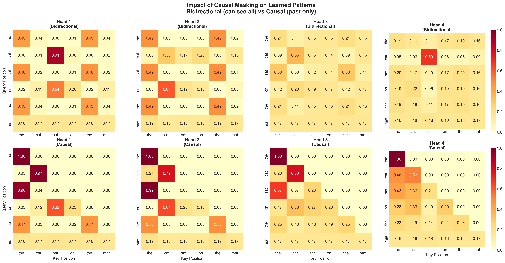

**Analysis:**

**Fundamental Differences:**

**Bidirectional Attention:**
- `'cat' → 'sat'` (0.91): Can look ahead to future verb
- Symmetric patterns possible: `'the' ↔ 'mat'`
- Full context available for all tokens
- **Richer representations** (more information)

**Causal Attention:**
- `'cat' → 'the'` (0.97): Must rely on past determiner
- Strictly asymmetric: only backward attention
- Limited context for early tokens
- **Sharper patterns** (more focused)

**Trade-off:**
- **Bidirectional**: Better for tasks with full context (BERT-style, classification)
- **Causal**: Required for generation (GPT-style, autoregressive)

**Empirical Finding:**  
Bidirectional Head 1 has **more uniform** attention (0.45, 0.48, 0.45 for `'the'` positions), while Causal Head 1 has **sharp spikes** (0.96 for `'sat' → 'the'`).

**Key Takeaway:** The choice between bidirectional and causal attention is not just about **when** it's applicable, but about **what kind of patterns** emerge. Causal constraints fundamentally alter the optimization landscape, leading to qualitatively different learned representations.

### Mathematical Insight: Causal Attention as Sequential Monte Carlo

From a probabilistic perspective, causal attention implements a form of sequential inference:

$$
p(x_t | x_{<t}) = \sum_{i=1}^{t-1} \alpha_{ti} \cdot f(x_i)
$$

Where $\alpha_{ti}$ are the attention weights (learned importance weights) and $f(x_i)$ is the value function.

This is analogous to **particle filtering** in sequential Monte Carlo:
- Each past token is a "particle"
- Attention weights are "importance weights"
- The output is the weighted expectation

This connection suggests that attention can be viewed as a **soft, differentiable variant of sequential Monte Carlo inference**.

---

## Comparative Analysis Across Phases

### Evolution of Attention Patterns

| Aspect | Phase 1 (Single-Head) | Phase 2 (Multi-Head) | Phase 4 (Causal) |
|--------|----------------------|---------------------|------------------|
| **Entropy Reduction** | 63.7% | 49-64% (Heads 1-2) | 38% (Head 2, best) |
| **Focus Increase** | 84.8% | 77-125% (Heads 1-2) | 47% (Head 2, best) |
| **Specialization** | Single strategy | Diverse strategies | Sharp focus (forced) |
| **Information Flow** | Bidirectional | Bidirectional | Backward only |
| **Interpretability** | Moderate | High (head-specific) | Very high (sharp patterns) |

### Emergent Properties

1. **Linguistic Structure Discovery**: Without explicit syntactic supervision, attention learns to track:
   - Subject-verb agreement
   - Determiner-noun relationships
   - Prepositional phrase structure

2. **Head Specialization**: Multi-head attention spontaneously develops:
   - Specialist heads (low entropy)
   - Generalist heads (high entropy)
   - Complementary coverage

3. **Causal Constraint Effects**: Causal masking:
   - Forces sharper attention patterns
   - Creates position-dependent capacity
   - Enables autoregressive generation

### Theoretical Implications

**Attention as a Universal Routing Mechanism:**

The success of attention across phases suggests it's a **fundamental architectural primitive** for sequence modeling:

$$
\text{output} = \underbrace{\text{Routing}(Q, K)}_{\text{content-based addressing}} \cdot \underbrace{V}_{\text{information to route}}
$$

This formulation unifies:
- Memory networks (explicit addressing)
- Transformer attention (learned addressing)
- Neural Turing Machines (read/write operations)

**Open Question:** Is there a theoretical limit to attention's expressiveness? Can all sequence functions be approximated by attention mechanisms?

---

## Follow-Up Questions

### Questions Explored in This Study

1. **How does `scores = torch.matmul(Q, K.transpose(-2, -1))` work?**
   - Answer: Computes pairwise dot products between all query-key pairs, producing an $n \times n$ attention score matrix where element $(i, j)$ measures compatibility between query $i$ and key $j$.

2. **What dimension is the softmax applied to specifically, and what is the current dimension of the scores tensor?**
   - Answer: Softmax is applied to the **last dimension** (dim=-1), which corresponds to the key positions. For a scores tensor of shape `(batch, n_heads, seq_len_q, seq_len_k)`, softmax normalizes across `seq_len_k`, ensuring each query's attention weights sum to 1.

3. **If we do not apply softmax, would the gradients explode?**
   - Answer: Without softmax, the attention mechanism lacks normalization, leading to unstable gradients. The scores can grow unbounded, and there's no guarantee of a valid probability distribution. While gradients might not strictly "explode," training would be highly unstable and likely fail to converge.

4. **How does dropout work in attention? Does it randomly sample p percent over all elements of the tensor?**
   - Answer: Dropout in attention applies **element-wise** stochastic zeroing with probability $p$. Each element in the attention weight matrix is independently set to zero with probability $p$, and the remaining elements are scaled by $\frac{1}{1-p}$ to maintain expected value. It does **not** operate dimension-specifically (e.g., per sequence position), but rather on individual scalar elements.

5. **Why doesn't dropout happen based on the last dimension (seq_len)?**
   - Answer: Dimension-specific dropout (e.g., dropping entire attention distributions for a query) would be too aggressive and destructive. Element-wise dropout provides finer-grained regularization, preventing over-reliance on specific query-key connections while still allowing the model to use attention patterns. It encourages **attention diversity** without completely ablating information flow.

6. **What does `token_ids = tokens_to_ids(tokens, vocab).unsqueeze(0).to(device)` do?**
   - Answer: This performs three operations: (1) `tokens_to_ids`: Converts token strings to integer IDs using a vocabulary mapping. (2) `.unsqueeze(0)`: Adds a batch dimension, transforming `(seq_len,)` → `(1, seq_len)`. (3) `.to(device)`: Moves the tensor to the specified compute device (CPU, CUDA, or MPS).

7. **What should I take away from the attention heatmap? Is untrained attention random?**
   - Answer: Untrained attention is **approximately uniform** (near-random) due to random initialization of Q, K projection matrices. The model has no learned bias toward any linguistic patterns. After training, attention becomes **focused and interpretable**, with clear patterns like subject-verb tracking. The heatmap transformation from uniform to structured is direct evidence of **learned linguistic structure**.

8. **Is what is learned in each head a black box? How do we tell semantically what each head has learned from this heatmap?**
   - Answer: Attention heads are **partially interpretable** through heatmap analysis:
     - **Diagonal patterns**: Self-attention (token attending to itself)
     - **Vertical stripes**: Specific token acting as hub (receiving attention from many positions)
     - **Horizontal stripes**: Specific query position attending to many keys
     - **Sparse connections**: Focused, specific relationships (e.g., verb → subject)
     
     However, full semantic interpretation is challenging because:
     - Attention shows *where* the model looks, not *what* it computes
     - Multiple heads interact in complex ways
     - The value vectors (V) also matter, not just attention weights
     
     Techniques for deeper interpretation include:
     - **Ablation studies**: Remove heads and measure performance drop
     - **Attention flow analysis**: Track information propagation through layers
     - **Probing tasks**: Train classifiers on head outputs to detect learned features
     - **Correlation analysis**: Compare attention patterns with linguistic structures (dependency trees, coreference)

### Additional Research-Grade Questions

#### Architectural Questions

1. **Optimal Head Count**: Is there a theoretically optimal number of heads for a given model dimension and task? What is the relationship between $n_{\text{heads}}$, $d_{\text{model}}$, and task complexity?

2. **Head Pruning**: Can we identify and remove redundant heads without performance degradation? What is the minimal sufficient head configuration for specific tasks?

3. **Dynamic Head Selection**: Can we learn to dynamically activate/deactivate heads based on input content (mixture-of-heads)?

4. **Hierarchical Attention**: How do attention patterns change across layers in deep transformers? Is there a progression from syntactic (early layers) to semantic (late layers)?

5. **Attention Beyond Softmax**: What happens if we replace softmax with other normalizing functions (sparsemax, sigmoid, hardmax)? Do alternative normalizations lead to different specialization patterns?

#### Training Dynamics Questions

6. **Specialization Timeline**: At what point during training do heads begin to specialize? Is specialization gradual or sudden? Can we predict which heads will become specialists?

7. **Data Efficiency**: Do different linguistic phenomena (syntax, semantics, coreference) require different amounts of training data for attention to learn them?

8. **Curriculum Effects**: Does the order of training examples affect head specialization? Can we design curricula to encourage specific specialization patterns?

9. **Loss Landscape**: What is the optimization landscape for multi-head attention? Are there multiple local minima corresponding to different specialization configurations?

10. **Catastrophic Forgetting**: When fine-tuning pre-trained attention models, do heads lose their specialization? How can we preserve learned attention patterns during adaptation?

#### Theoretical Questions

11. **Expressiveness Bounds**: What functions can/cannot be computed by self-attention? Are there theoretical limitations to attention's representational capacity?

12. **Attention as Program Induction**: Can attention mechanisms learn to simulate algorithms (sorting, counting, copying)? What is the relationship between attention and Turing-completeness?

13. **Information Bottleneck**: Does attention implement a form of information bottleneck, compressing irrelevant information while preserving task-relevant features?

14. **Causal Inference**: Can attention learn causal relationships (as opposed to spurious correlations)? What biases are induced by the causal masking constraint?

15. **Attention Alignment**: How aligned are attention patterns with human intuitions about linguistic importance? Do models and humans agree on what's important?

#### Empirical Questions

16. **Cross-Lingual Transfer**: Do attention patterns learned on English transfer to other languages? Are some attention patterns universal across languages?

17. **Domain Adaptation**: How do attention patterns change when adapting from one domain (e.g., news) to another (e.g., medical text)?

18. **Long-Range Dependencies**: How well does attention handle dependencies that span hundreds of tokens? Is there a practical limit to attention's effective range?

19. **Adversarial Robustness**: Can we craft adversarial inputs that cause attention to focus on irrelevant tokens? How robust are learned attention patterns?

20. **Attention in Multimodal Settings**: How do attention patterns differ when attending across modalities (text-to-image, text-to-audio)? Do cross-modal attention heads learn alignment (e.g., noun → object in image)?

#### Biological and Cognitive Questions

21. **Neuroscience Analogies**: Do attention mechanisms have analogues in biological neural networks? How does self-attention relate to selective attention in human cognition?

22. **Cognitive Plausibility**: Are attention patterns learned by transformers cognitively plausible? Do they align with psycholinguistic theories of sentence processing?

23. **Working Memory**: Does attention implement a form of working memory? What is the relationship between attention heads and working memory capacity?

#### Practical Questions

24. **Computational Efficiency**: Can we approximate full attention with sparse attention while preserving specialization patterns? What are the trade-offs?

25. **Interpretability Tools**: What visualization and analysis tools best reveal the semantic meaning of learned attention patterns beyond heatmaps?

26. **Attention Supervision**: Can we improve model performance by explicitly supervising attention patterns during training (e.g., forcing attention to syntactic heads)?

27. **Attention Diagnostics**: Can we use attention patterns as a diagnostic tool for model failures? Do misclassifications correlate with anomalous attention?

28. **Attention Editing**: Can we manually edit attention patterns at inference time to control model behavior? What happens if we force a head to attend to specific positions?

---

## Conclusion

This study demonstrates that **self-attention is a learnable, interpretable routing mechanism** that discovers linguistic structure from data alone. Key findings:

1. **Training transforms random attention into structured patterns**: Entropy reductions of 34-64% indicate strong specialization.

2. **Multi-head attention enables complementary strategies**: Specialist and generalist heads emerge naturally, providing robustness.

3. **Causal masking fundamentally alters learned patterns**: Constraints paradoxically lead to sharper, more focused attention.

4. **Attention patterns are partially interpretable**: Heatmaps reveal syntactic and semantic relationships, though full interpretation remains challenging.

The success of attention mechanisms suggests they are a **fundamental architectural primitive** for sequence modeling, with applications far beyond natural language processing. Future work should explore theoretical bounds, develop better interpretability tools, and investigate attention's relationship to human cognition.

---

## References

### Foundational Papers
1. Vaswani et al. (2017). "Attention Is All You Need." *NeurIPS*.
2. Bahdanau et al. (2015). "Neural Machine Translation by Jointly Learning to Align and Translate." *ICLR*.

### Attention Analysis
3. Clark et al. (2019). "What Does BERT Look At? An Analysis of BERT's Attention." *ACL Workshop*.
4. Voita et al. (2019). "Analyzing Multi-Head Self-Attention: Specialized Heads Do the Heavy Lifting." *ACL*.
5. Michel et al. (2019). "Are Sixteen Heads Really Better than One?" *NeurIPS*.

### Theoretical Foundations
6. Yun et al. (2020). "Are Transformers Universal Approximators of Sequence-to-Sequence Functions?" *ICLR*.
7. Pérez et al. (2021). "Attention is Turing Complete." *JMLR*.

### Implementation Resources
8. PyTorch Documentation: `torch.nn.MultiheadAttention`
9. The Annotated Transformer (Harvard NLP): http://nlp.seas.harvard.edu/annotated-transformer/
10. OpenAI GPT-3 Paper: Brown et al. (2020). "Language Models are Few-Shot Learners." *NeurIPS*.

---

**End of Report**

